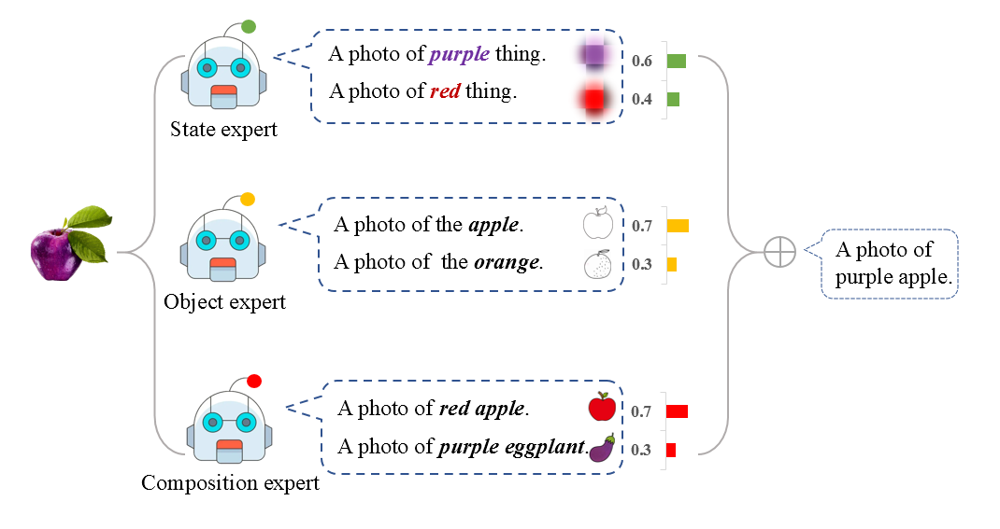

# Hierarchical Prompt Learning for Compositional Zero-Shot Recognition

Code for the IJCAI 2023 paper:

> **Title:** Hierarchical Prompt Learning for Compositional Zero-Shot Recognition<br> > **Authors:** Henan Wang, Muli Yang, Kun Wei, and Cheng Deng<br> > **Paper:** [PDF](https://www.ijcai.org/proceedings/2023/0163.pdf)

## Introduction

**Abstract:** Compositional Zero-Shot Learning (CZSL) aims to imitate the powerful generalization ability of human beings to recognize novel compositions of known primitive concepts that correspond to a state and an object, e.g., “purple apple”. To fully capture the intra- and inter-class correlations between compositional concepts, in this paper, we propose to learn them in a hierarchical manner. Specifically, we set up three hierarchical embedding spaces that respectively model the states, the objects, and their compositions, which serve as three “experts” that can be combined in inference for more accurate predictions. We achieve this based on the recent success of large-scale pretrained Vision-Language Models, e.g., CLIP, which provides a strong initial knowledge of image-text relationships. To better adapt this knowledge to CZSL, we propose to learn three hierarchical prompts by explicitly fixing the unrelated word tokens in the three embedding spaces.
<br>

<p align="center">
     <br />
    <em>
    The illustration of our motivation.
    </em>
</p>

## Setup

- **Environment:**

```
conda create --name clip python=3.7
conda activate clip
pip3 install torch torchvision --extra-index-url https://download.pytorch.org/whl/cu113
pip3 install ftfy regex tqdm scipy pandas
pip3 install git+https://github.com/openai/CLIP.git
```

Alternatively, you can use `pip install -r requirements.txt` to install all the dependencies.

- **Datasets:**
  We experiment with three datasets: MIT-States, UT-Zappos, and C-GQA.

```
sh download_data.sh
```

If you already have setup the datasets, you can use symlink and ensure the following paths exist:
`data/<dataset>` where `<datasets> = {'mit-states', 'ut-zappos', 'cgqa'}`.

## Commands

```
python -u train.py \
  --dataset mit-states \
  --clip_model ViT-L/14 \
  --experiment_name hpl \
  --train_prefix no \
  --seed 0 \
  --epochs 20 \
  --lr 5e-05 \
  --attr_dropout 0.3 \
  --weight_decay 0.00001 \
  --train_batch_size 64 \
  --gradient_accumulation_steps 2 \
  --context_length 8 \
  --save_path logs/mit/exp \
  --save_every_n 1
```

You can replace `--dataset` with `{mit-states, ut-zappos, cgqa}`, and you can decide whether to train the prompt prefix 'A Photo of' with argument `--train_prefix`.

## Acknowledgements

Our work is inspired from many recent efforts in various fields:

- [CSP](https://github.com/BatsResearch/csp)
- [CLIP](https://github.com/openai/CLIP)
- [CZSL](https://github.com/ExplainableML/czsl)
- [DeCa](https://github.com/muliyangm/DeCa)

Many thanks for their great work!

## Citations

If you find our work helpful, please consider citing our [paper](https://www.ijcai.org/proceedings/2023/0163.pdf):

```
@inproceedings{wang2023hierarchical,
  title={Hierarchical Prompt Learning for Compositional Zero-Shot Recognition},
  author={Wang, Henan and Yang, Muli and Wei, Kun and Deng, Cheng},
  booktitle={International Joint Conference on Artificial Intelligence (IJCAI)},
  pages={1470--1478},
  year={2023}
}
```
